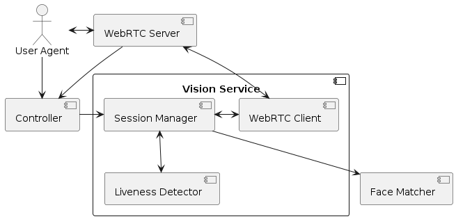
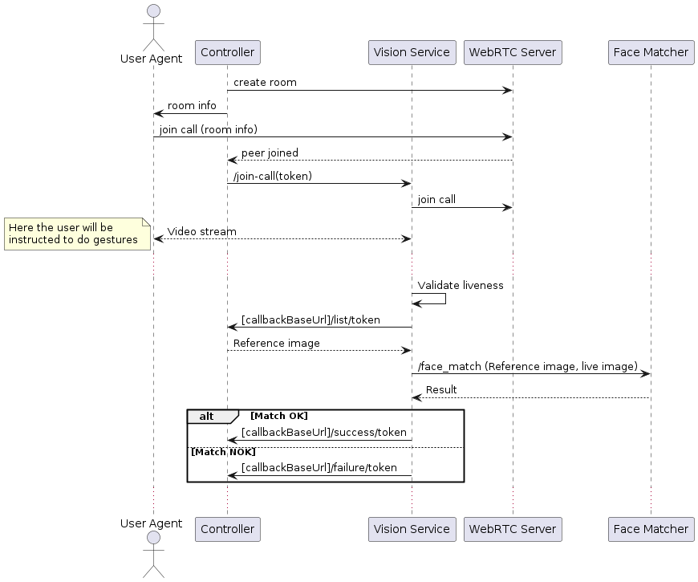

=======
# Vision Service

**Vision** is a set of tools for capturing and verifying human biometrics. They are put together and orchestrated by **Vision Service**, a backend that exposes a simple API to initiate biometric verification flows.

## Basic deployment diagram

The following is a typical deployment where Vision Service is in place. Managed by a **Controller**, which is its main consumer and the one who will start verification flows and make sure to provide the appropriate resources to get subject data.



Vision Service performs biometric verification flows based on video calls and reference images. Video calls are handled by a **WebRTC server** where it will connect to retrieve subject video stream and send its own stream (which contains instructions for the subject to prove liveness). This service can join calls by using its  Mediasoup client. See [WebRTC Server](https://github.com/2060-io/webrtc-server) as a ready-to-use service to manage video calls compatible with it).

It is up to each implementor to determine how to enroll users (in order to create reference images) and get them into a video call to perform liveness checking. The only requirement for Vision is the controller to implement the required callbacks and to provide a valid room URL to allow Vision Service to join the call.


Once it detects that it is a live person on the other end, Vision Service gets reference images (provided by the Controller) and compares them by relying on a **Face Matcher** service.

## Biometric verification flow overview

From Vision Service point of view, the flow starts when the Controller sends a "Join Call" request: at that point, it is supposed to have already created a Video Call and invited the subject to enter to it. It will pass a `token` on this request, that will be used by the Controller to identify which flow Vision Service refers to when sends requests to the callback URLs (that the Controller will need to implement), since this is an asynchronous process.

In the middle of the flow, Vision Service will require to retrieve reference images, so once it is sure that it is a live person, it will check if it matches the one on the reference. It is responsibility of the Controller to provide, through a callback URL, the list of reference images (typically a single one, for instance, the one from user passport).

The following diagram shows an example of a typical video verification flow using Vision.




## API

Vision Service API is quite simple: flows are started by a simple endpoint where all configuration parameters are set, and results are posted in callback URLs that the caller must implement in order to receive updates asynchronously.

### Join Call (/join-call)

This single endpoint receives a POST with a JSON body with the following fields:

- **ws_url**: full WebSocket URL to join the call. This includes parameters like `roomId` and `peerId`
- **callback_base_url**: webhook base URL (must be implemented by the caller, see below)
- **datastore_base_url**: (OPTIONAL) Used in case reference images are stored in a Data Store (i.e. accessible in `[datastore_base_url]/r/token`)
- **token**: controller-defined string to reference the flow in callback URLs
- **lang**: user-facing ISO 639-1 language code. At the moment, only 'es' and 'en' are supported


Example: 

```curl
curl -X POST http://localhost:5000/join-call \
    -H "Content-Type: application/json" \
    -d '{
          "ws_url": "wss://dts-webrtc.dev.2060.io:443/?roomId=1234&peerId=192324",
          "datastore_base_url": "https://ds.dev.2060.io",
          "callback_base_url": "https://unic-id-issuer-dts.dev.2060.io",
          "token": "{UUID}",
          "lang": "es"
        }'
```

### Callbacks

In order to properly complete a biometric verification flow, the controller needs to implement the following callbacks:

#### Reference image list

- Type: GET
- Endpoint: [callbackBaseUrl]/list/:token


Vision Service uses this endpoint to query about input images related to a given flow (identified by the `token`). It will use them to determine if the person in the live stream is who is supposed to be.

Reference images are returned in the response body as a JSON array of strings, whose items can be either:

- A data URL containing base64-coded image (e.g. `data:image/jpeg;base64,abcd...`)
- A regular URL, accesible by Vision Service, to download through an HTTP GET (e.g. `https://myhost/myimage.jpg`)
- **Deprecated** A file ID, used in case that images are stored in a [2060 Data Store](https://github.com/2060-io/2060-datastore). To use this, `datastore_base_url` must be defined in Join Call request.

To receive feedback about the results of biometric verifications, Vision controller needs to implement two endpoints that receive PUT requests:

#### Success

- Type: PUT
- Endpoint: `[callbackBaseUrl]/success/:token`

This is called by Vision Service when a flow completes succesfully. No body data is appended.


#### Failure

- Type: PUT
- Endpoint: `[callbackBaseUrl]/failure/:token`

This is called by Vision Service when there is an error in a flow. No body data is appended.

## Configuration

Most configuration is done by environment variables. These variables might be set also in `.env` file in the form of KEY=VALUE (one per line).

| Variable                   | Description                                     | Default value           |
| -------------------------- | ----------------------------------------------- | ----------------------- |
| PORT                 | Local port where the app will be running        | 5000                    |
| HOST                 | Specific network interface to bind the service (0.0.0.0 to all)                   | 0.0.0.0                    |
| VISION_MATCHER_BASE_URL           | URL where Face matcher is located          | http://localhost:5123                    |
| NUMBER_OF_GESTURES_TO_REQUEST | Number of gestures to request in liveness detection flow | 2                    |
| GLASSES_DETECTOR_MODE | Define how glasses detection works: WARNING_ONLY will only show a warning message. ERROR will fail immediately if glasses are detected in the face. OFF will disable the glass detector | OFF                    |
| USE_MEDIASOUP_ICE_RELAY | Whether to use an ICE relay for WebRTC | False                    |
| VERBOSE                | If defined, it will log up to DEBUG level            | not defined           |
| ENABLE_DEBUG_ENDPOINTS            | Add some endpoints useful for debugging purposes. Not suitable for production.                     | False |

## How to run locally

### Option 1: Traditional Installation

1. Clone the repository:

```terminal
git clone ...
```

2. Create a new Python environment (recommended):

```terminal
python -m venv myenv
source myenv/bin/activate # For Linux or macOS
./myenv/Scripts/activate # For Windows
```

3. Install the dependencies using pip:

```terminal
pip install -r requirements.txt
```

4. Set up the environment by creating an `.env` file with the required configuration variables.

5. Start the application:

```terminal
python main.py
```

### Option 2: Docker Installation

1. Build the Docker image from the Dockerfile:

```terminal
docker build -t vision-service .
```

2. Run the Docker container:

```terminal
docker run -d --network host vision-service
```

*Note:* As this is a WebRTC application, running the Docker container with host networking mode is recommended for better performance and compatibility.

### Testing

This service relies on external components, and therefore you will need to have an instance of each of them in order to test the entire flow. However, you can leverage some demo deployments to do a quick test by following the procedure described in this section.

#### Set up and run test controller

This repo contains, under `test` a demo controller that implements the callbacks used to get reference images and report flow status. This is a very simple web application that serves static images you can put under `test/assets` directory. 

The only thing you have to do is to put your reference image, e.g. `1234.jpg` into this directory, and then run:

```
PUBLIC_BASE_URL=http://my-ip:5001 python callbacks.py
```

Where `PUBLIC_BASE_URL` is an URL accessible by Vision Service. By default, this controller uses port 5001 but it can be overriden by setting PORT environment variable.

Keep this terminal open to see further updates from Vision Service flows.

#### Create room and live stream

In a web browser, go to https://webrtc-webclient.demos.2060.io and connect to the call. You can then copy the Invitation Link, which will have the following structure:

```https://webrtc-webclient.dev.2060.io/?domain=[WEBRTC_SERVER_HOST]&protooPort=443&roomId=[ROOM_ID]```


#### Run Vision Service

Run it either locally or by using Docker, as explained above. Make sure to specify `VISION_MATCHER_BASE_URL` environment variable, in order to let Vision Serice perform face matching. You can use http://vision-matcher.demos.2060.io or your own by executing:

```
docker run -p 5123:5123 io2060/vision-matcher:latest
```

In such case, your VISION_MATCHER_BASE_URL will be http://localhost:5123.

#### Start verification flow

Now you can do a POST request to Vision Service by using cURL: 

```
curl -X POST http://localhost:5000/join-call \
    -H "Content-Type: application/json" \
    -d '{
          "ws_url": "wss://[WEBRTC_SERVER_HOST]:443/?roomId=[ROOM_ID]&peerId=192324",
          "callback_base_url": "[PUBLIC_BASE_URL]",
          "token": "[REFERENCE_IMAGE_FILENAME]",
          "lang": "en"
        }
```

In this command, note that:

- `WEBRTC_SERVER_HOST` and `ROOM_ID` are the ones you got from the Invitation Link in the previous step
- `PUBLIC_BASE_URL` is the public base URL of your test controller (i.e. an URL accesible by your Vision Service instance, e.g. http://localhost:5001 or http://192.168.0.10:5001)
- `REFERENCE_IMAGE_FILENAME` is the name of the image you added into assets directory (e.g. 1234.jpg)

If everything works fine, Vision Service will respond immediately with a succesful HTTP status, and join the call, where you'll be able to follow the instructions and perform the biometric verification.

Once the flow is finished, in the terminal where you are running your test controller you'll see lines containing `Success` or `Failure`, depending on the reference images correspondence to your face.